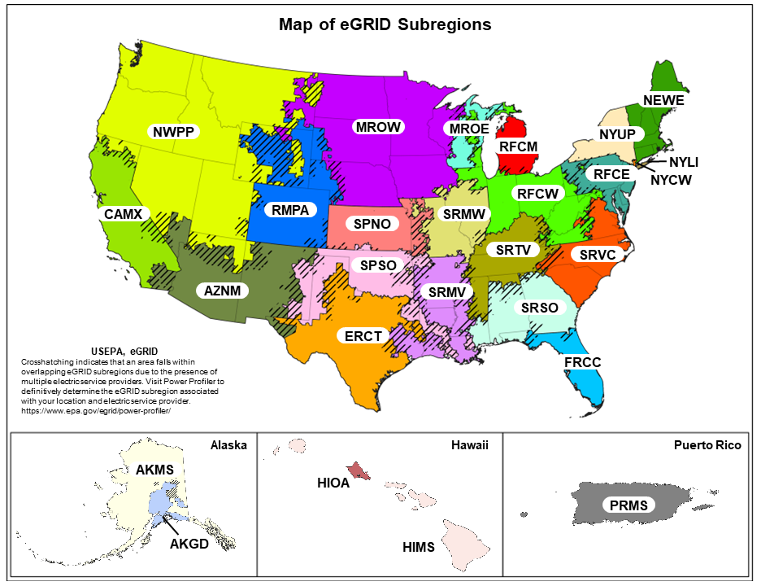
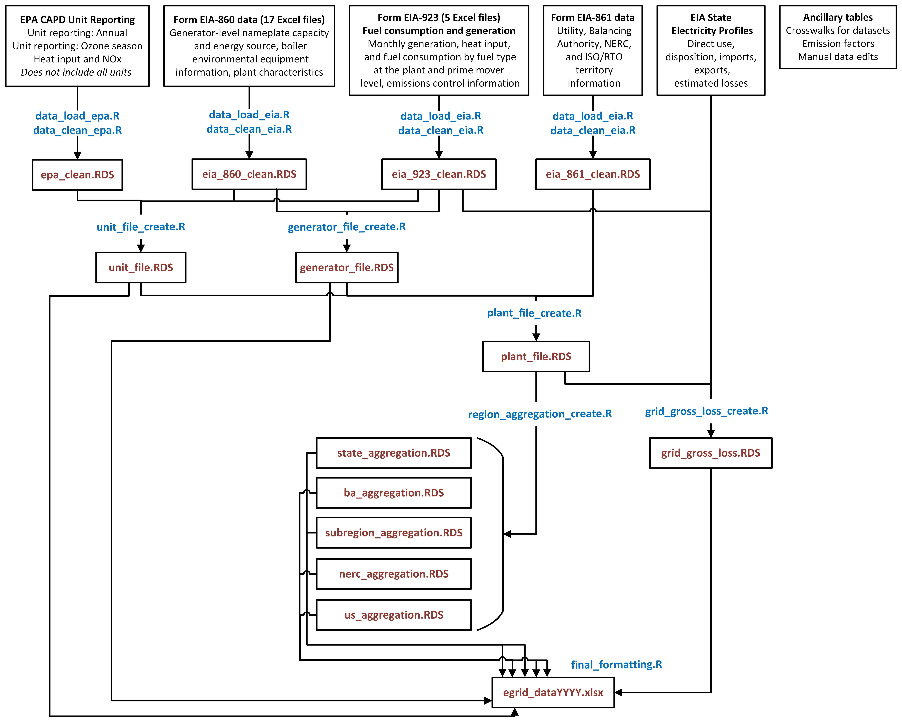
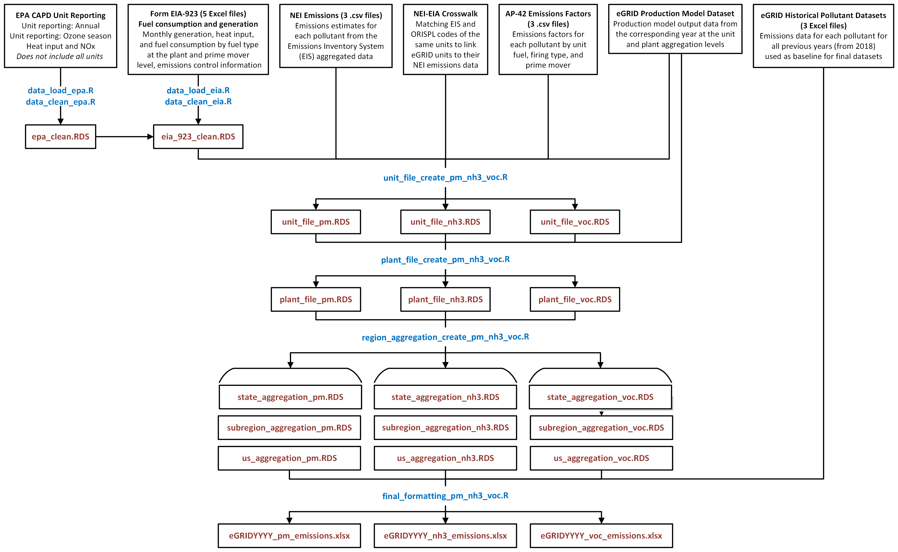

# eGRID

This repository includes all necessary scripts and documentation to create the [Emissions & Generation Resource Integrated Database (eGRID)](https://www.epa.gov/egrid) and its supplemental features and datasets.

## Background

eGRID is a comprehensive source of data from [EPA's Clean Air and Power Division (CAPD)](https://epa.gov/power-sector) on the environmental 
characteristics of almost all electric power generated in the United States. eGRID is based on available plant-specific data for all 
U.S. electricity generating plants that provide power to the electric grid and report emissions and electricity data to the U.S. government. Data reported include, 
but are not limited to, net electric generation; resource mix (the share of generation by resource or fuel type); mass emissions of carbon dioxide 
(CO2), nitrogen oxides (NOx), sulfur dioxide (SO2), methane (CH4), and nitrous oxide (N2O); emission rates for CO2, NOx, SO2, 
CH4, and N2O; heat input; and nameplate capacity. eGRID reports this information on an annual basis (as well as by ozone season for 
heat input and NOx) at different levels of geographic aggregation.

### eGRID Repository Components
The primary eGRID dataset is referred to in this repository as the eGRID production model. Additional supplementary datasets and tools utilize the eGRID production model to provide more information about certain aspects of the U.S. electric grid. The eGRID repository cumulatively consists of the following components:

-   Production model

-   PM2.5, NH3, and VOC emissions

### Production model

The final eGRID production model dataset includes eight levels of data aggregation:

-   **Generator**: A set of equipment that produces electricity and is connected to the U.S. electricity grid. 

-   **Unit**: A set of equipment that either produces electricity and is connected to the U.S electricity grid or 
a set of equipment that is connected to a generator which produces electricity and is connected to the U.S. electricity grid.

-   **Plant**: A facility with one or more units and/or generators that provide power to the electric grid.

-   **State**: U.S. states, Puerto Rico (PR), and the District of Columbia (DC).

-   **Balancing authority**: Regional power system operators that ensure a balance of supply and demand.

-   **eGRID subregion**: EPA defined subregions designed to limit the impacts of the import and export of electricity (shown in Figure 1).

-   **NERC (North American Electric Reliability Corporation) regions**: Each NERC region listed in eGRID represents one of nine regional 
portions of the North American electricity transmission grid: six in the contiguous United States, plus Alaska, Hawaii, and 
Puerto Rico (which are not part of the formal NERC regions but are considered so in eGRID).

-   **National U.S.**: Contains all 50 states, Puerto Rico (PR), and the District of Columbia (DC).

Further information on the eGRID methodology can be found in the [eGRID Technical Guide](https://www.epa.gov/egrid/egrid-technical-guide).

The dataset that this code produces is publicly available [here](https://www.epa.gov/egrid/download-data).

### PM2.5, NH3, and VOC emissions
The eGRID production model does not include fine particulate matter 2.5 microns in diameter or smaller (PM2.5), ammonia (NH3), and volatile organic compounds (VOC) emissions as the data used for the production model emissions calculations are not available for those pollutants. Instead, PM2.5, NH3, and VOC emissions and emission rates for power plants are estimated using data from the EPA's National Emissions Inventory (NEI).

The final dataset for each pollutant (PM2.5, NH3, and VOC) type includes five of the data aggregation levels present in the production model (see region descriptions above under Production model):

-   Unit

-   Plant

-   State

-   eGRID subregion

-   National U.S.

Further information on the eGRID PM2.5, NH3, and VOC methodology can be found in the [Particulate Matter Emissions for eGRID2021](https://www.epa.gov/system/files/documents/2024-06/egrid2021-draft-pm-memo.pdf) methodology documentation.

The dataset that this code produces is publicly available [here](https://www.epa.gov/egrid/egrid-pm25).

## Architecture

Starting in 2024, EPA has released the methodology to develop eGRID as an RStudio project. Recently, there has been increased interest from users in understanding the methods used to create the eGRID data. To increase transparency in the eGRID production process, EPA has made the R scripts available for users to view and use. EPA used the RStudio project beginning in 2024 to produce eGRID2023.

### Production model

Figure 2 displays a summary of the eGRID production model architecture, which specifies data sources, inputs, and outputs for creating the eGRID production model.

A data dictionary is provided in `eGRID Production Model Data Dictionary.xlsx`. This file provides the row number, name, description, imperial units, metric units, source, and calculation method for each column reported in the final eGRID production model dataset.

### PM2.5, NH3, and VOC emissions

Figure 3 displays a summary of eGRID PM2.5, NH3, and VOC emissions architecture, which specifies data sources, inputs, and outputs for creating the eGRID PM2.5, NH3, and VOC emissions and emission rates datasets.

## Code base organization

This project is structured as an RStudio project. To ensure that all scripts run correctly, load the `eGRID_R.Rproj` within RStudio to enable the project environment. 

### Production model

`eGRID_master.qmd` is a Quarto document that serves as a master script (i.e., it runs all necessary scripts in the correct order), while also providing documentation for the scripts and steps performed therein.

The production model code base is structured as follows:

-   `scripts/1_production_model/`: all scripts to download and clean data, create each data aggregation level, format final dataset, and convert to metric units.

-   `scripts/functions/`: all helper functions.

-   `data/1_production_model/raw_data/`: raw data obtained from EPA and EIA sites.

-   `data/1_production_model/clean_data/`: data created from EPA and EIA data cleaning steps.

-   `data/1_production_model/outputs/`: outputs generated by this code base.

-   `data/1_production_model/static_tables/`: static tables used within the code base. These include crosswalks that match data between EIA and EPA data or regions and manual corrections that are made.

The data used to create the eGRID production model are EPA and Energy Information Administration (EIA) electricity data. EPA data are loaded via an application programming interface (API) in `scripts/1_production_model/data_load_epa.R` and cleaned in `scripts/1_production_model/data_clean_epa.R`. EIA data are downloaded from EIA's website in `scripts/1_production_model/data_load_eia.R` and `scripts/functions/function_download_eia_files.R` and cleaned in `scripts/1_production_model/data_clean_eia.R`.

### PM2.5, NH3, and VOC emissions

Similar to the production model, `pm_nh3_voc_master.qmd` is a master script used to organize all necessary scripts and document the steps taken to produce PM2.5, NH3, and VOC emissions and emission rates. PM2.5, NH3, and VOC emissions and emission rates calculations utilize the eGRID production model code and build off the final eGRID production model dataset, with a similar code base structure:

-   `scripts/2a_pm_nh3_voc/`: PM2.5, NH3, and VOC emissions scripts to create each data aggregation level and format final dataset.

-   `scripts/functions/`: all helper functions.

-   `data/2a_pm_nh3_voc/inputs/`: emissions input data provided by EPA.

-   `data/2a_pm_nh3_voc/outputs/`: outputs generated by this code base for PM2.5, NH3, and VOC emissions.

-   `data/2a_pm_nh3_voc/static_tables/`: static tables used within the code base. These include emissions factors for PM2.5, NH3, and VOCs.

The data used to create the PM2.5, NH3, and VOC emissions and emission rates data are EPA and EIA electricity data, NEI emissions data, an NEI-EIA facility and unit identifier crosswalk, and the eGRID production model dataset. EPA and EIA data are acquired in the same way as the production model while NEI emissions data and NEI-EIA crosswalk data are provided directly from the EPA.

## Creating eGRID

### Production model

To create the eGRID production model dataset:

1.  Obtain an API key for EPA data.
    -   Request an API key from <https://www.epa.gov/power-sector/cam-api-portal>.
    -   Create folder `api_keys/` within the root of the eGRID.
    -   Create a text file named `epa_api_key.txt` within the folder `api_keys/` and save the API key here on a single line.
2.  Load `eGRID_R.Rproj` within RStudio to enable the project environment.
3.  Render `eGRID_master.qmd`.
    -   Set data year in `params` (eGRID_year) in the YAML as a string in the format "YYYY" (ex: `"2023"`).
    -   Render `eGRID_master.qmd`. This will run all scripts and build the eGRID production model dataset.

### PM2.5, NH3, and VOC emissions

The PM2.5, NH3, and VOC emissions and emission rates datasets use eGRID production model outputs and require that the production model dataset is already produced for the desired data year.

**Note on data availability:** Emissions data and crosswalks used in these calculations are from a version of EPA's NEI that are not publicly available. Information about the data inputs and the code used to produce the final data are included here to document the process and inform any need for replication as well as inform data production for those with access to the appropriate NEI data.

To create the eGRID PM2.5, NH3, and VOC emissions datasets:

1.  Obtain an API key for EPA data.
    -   Request an API key from <https://www.epa.gov/power-sector/cam-api-portal>.
    -   Create folder `api_keys/` within the root of the eGRID.
    -   Create a text file named `epa_api_key.txt` within the folder `api_keys/` and save the API key here on a single line.
2.  Confirm the eGRID production model data has been produced and is stored in `data/1_production_model/outputs/`.
3.  Load `eGRID_R.Rproj` within RStudio to enable the project environment.
4.  Render `pm_nh3_voc_master.qmd`.
    -   Set data year in `params` (eGRID_year) in the YAML as a string in the format "YYYY" (ex: `"2023"`).
    -   If you do not have access to the NEI data inputs, set evaluation method in `params` (eval) to `false`.
    -   Render `pm_nh3_voc_master.qmd`. If `eval:true`, this will run all scripts and build the PM2.5, NH3, and VOC emissions datasets. If `eval:false`, this will produce the documentation around dataset production but will not build the datasets themselves.

## Outputs

### Production model

The codebase outputs each data aggregation level in the eGRID dataset as an .RDS file and the final dataset as an Excel sheet in `data/1_production_model/outputs/{params$eGRID_year}`. Rendering `eGRID_master.qmd` also creates an HTML file that summarizes the data, methods, and output files used and created throughout the code base.

### PM2.5, NH3, and VOC emissions

For each pollutant (PM2.5, NH3, VOC), the codebase outputs each data aggregation level as an .RDS file. Additionally, the final data is added to the previous year’s data in an Excel sheet and is stored in `data/2a_pm_nh3_voc/outputs/{params$eGRID_year}`.

The resulting final outputs include:
-   `egrid{params$eGRID_year}_pm_emissions.xlsx`
-   `egrid{params$eGRID_year}_nh3_emissions.xlsx`
-   `egrid{params$eGRID_year}_voc_emissions.xlsx`

Rendering `pm_nh3_voc_master.qmd` also creates an HTML file that summarizes the data, methods, and output files used and created throughout the code base.

## QA

The codebase contains two QA files as Quarto documents:

-   `qa_all.qmd`: Annual checks to confirm results are as expected for each file created in the codebase.

-   `qa_annual_comparison.qmd`: Comparison of output data to previous eGRID years.

## Contributing to eGRID

Please submit any questions about the eGRID dataset to [this web form](https://www.epa.gov/egrid/forms/contact-us-about-egrid).

If you would like to ask a question about or report an issue in the code, review the CONTRIBUTING policy and submit an issue under the "Issues" tab in the GitHub repository. Provide a concise summary as the title of the issue and a clear description, including steps to reproduce the issue.

## Disclaimer

The United States Environmental Protection Agency (EPA) GitHub project code is provided on an "as is" basis and the user assumes responsibility for its use. EPA has relinquished control of the information and no longer has responsibility to protect the integrity , confidentiality, or availability of the information. Any reference to specific commercial products, processes, or services by service mark, trademark, manufacturer, or otherwise, does not constitute or imply their endorsement, recommendation or favoring by EPA. The EPA seal and logo shall not be used in any manner to imply endorsement of any commercial product or activity by EPA or the United States Government.
