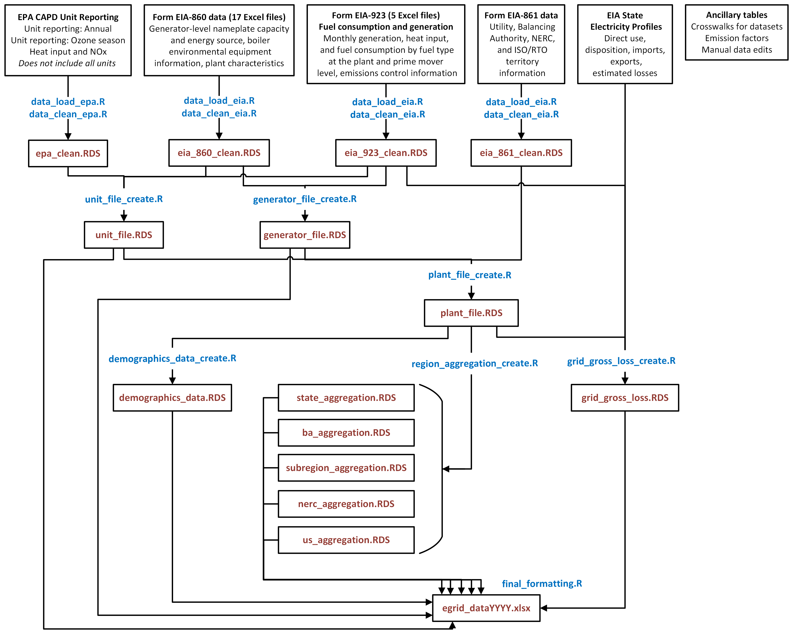

# eGRID

This repository includes all necessary scripts and documentation to create the [Emissions & Generation Resource Integrated Database (eGRID)](https://www.epa.gov/egrid).

## Background

eGRID is a comprehensive source of data from [EPA's Clean Air and Power Division (CAPD)](https://epa.gov/power-sector) on the environmental 
characteristics of almost all electric power generated in the United States. eGRID is based on available plant-specific data for all 
U.S. electricity generating plants that provide power to the electric grid and report emissions and electricity data to the U.S. government. Data reported include, 
but are not limited to, net electric generation; resource mix (the share of generation by resource or fuel type); mass emissions of carbon dioxide 
(CO2), nitrogen oxides (NOx), sulfur dioxide (SO2), methane (CH4), and nitrous oxide (N2O); emission rates for CO2, NOx, SO2, 
CH4, and N2O; heat input; and nameplate capacity. eGRID reports this information on an annual basis (as well as by ozone season for 
heat input and NOx) at different levels of geographic aggregation.

The final eGRID dataset includes eight levels of data aggregation:

-   **Generator**: A set of equipment that produces electricity and is connected to the U.S. electricity grid. 

-   **Unit**: A set of equipment that either produces electricity and is connected to the U.S electricity grid or 
a set of equipment that is connected to a generator which produces electricity and is connected to the U.S. electricity grid.

-   **Plant**: A facility with one or more units and/or generators that provide power to the electric grid.

-   **State**: U.S. states, Puerto Rico (PR), and the District of Columbia (DC).

-   **Balancing authority**: Regional power system operators that ensure a balance of supply and demand.

-   **eGRID subregion**: EPA defined subregions designed to limit the impacts of the import and export of electricity (shown in Figure 1).

-   **NERC (North American Electric Reliability Corporation) regions**: Each NERC region listed in eGRID represents one of nine regional 
portions of the North American electricity transmission grid: six in the contiguous United States, plus Alaska, Hawaii, and 
Puerto Rico (which are not part of the formal NERC regions but are considered so in eGRID).

-   **National U.S.**: Contains all 50 states, Puerto Rico (PR), and the District of Columbia (DC).

Further information on the eGRID methodology can be found in the [eGRID Technical Guide](https://www.epa.gov/egrid/egrid-technical-guide).

The dataset that this code produces is publicly available [here](https://www.epa.gov/egrid/download-data).

## Architecture

This year EPA will be releasing the methodology to develop eGRID as an RStudio project. Recently, there has been increased interest from users in understanding the methods used to create the eGRID data. To increase transparency in the eGRID production process, EPA has made the R scripts available for users to view and use. EPA used the RStudio project beginning in 2024 to produce eGRID2023.

Figure 2 displays a summary of eGRID architecture, which specifies data sources, inputs, and outputs for creating eGRID.

A data dictionary is provided in `eGRID Production Model Data Dictionary.xlsx`. This file provides the row number, name, description, imperial units, metric units, source, and calculation method for each column reported in the final eGRID dataset.

## Code base organization

This project is structured as an RStudio project. To ensure that all scripts run correctly, load the `eGRID_R.Rproj` within RStudio to enable the project environment. `eGRID_master.qmd` is a Quarto document that serves as a master script (i.e., it runs all necessary scripts in the correct order), while also providing documentation for the scripts and steps performed therein.

The code base is structured as follows:

-   `scripts/`: all scripts to download and clean data, create each data aggregation level, format final dataset, and convert to metric units.

-   `scripts/functions/`: all helper functions.

-   `data/raw_data/`: raw data obtained from EPA and EIA sites.

-   `data/clean_data/`: data created from EPA and EIA data cleaning steps.

-   `data/outputs/`: outputs generated by this code base.

-   `data/static_tables/`: static tables used within the code base. These include crosswalks that match data between EIA and EPA data or regions and manual corrections that are made.

The data used to create eGRID are EPA and Energy Information Administration (EIA) electricity data. EPA data are loaded via an application programming interface (API) in `scripts/data_load_epa.R` and cleaned in `scripts/data_clean_epa.R`. EIA data are downloaded from EIA's website in `scripts/data_load_eia.R` and `scripts/functions/function_download_eia_files.R` and cleaned in `scripts/data_clean_eia.R`.

## Creating eGRID

To create the eGRID dataset:

1.  Obtain an API key for EPA data.
    -   Request an API key from <https://www.epa.gov/power-sector/cam-api-portal>.
    -   Create folder `api_keys/` within the root of the eGRID.
    -   Create a text file named `epa_api_key.txt` within the folder `api_keys/` and save the API key here on a single line.
2.  Load `eGRID_R.Rproj` within RStudio to enable the project environment.
3.  Render `eGRID_master.qmd`.
    -   Set data year in `params` (eGRID_year) in the YAML as a string in the format "YYYY" (ex: `"2023"`).
    -   Render `eGRID_master.qmd`. This will run all scripts and build the eGRID dataset.

## Outputs

The codebase outputs each data aggregation level in the eGRID dataset as an .RDS file and the final dataset as an Excel sheet in `data/outputs/{params$eGRID_year}`. Rendering `eGRID_master.qmd` also creates an HTML file that summarizes the data, methods, and output files used and created throughout the code base.

## QA

The codebase contains two QA files as Quarto documents:

-   `qa_all.qmd`: Annual checks to confirm results are as expected for each file created in the codebase.

-   `qa_annual_comparison.qmd`: Comparison of output data to previous eGRID years.

## Contributing to eGRID

Please submit any questions about the eGRID dataset to [this web form](https://www.epa.gov/egrid/forms/contact-us-about-egrid).

If you would like to ask a question about or report an issue in the code, review the CONTRIBUTING policy and submit an issue under the "Issues" tab in the GitHub repository. Provide a concise summary as the title of the issue and a clear description, including steps to reproduce the issue.

## Disclaimer

The United States Environmental Protection Agency (EPA) GitHub project code is provided on an "as is" basis and the user assumes responsibility for its use. EPA has relinquished control of the information and no longer has responsibility to protect the integrity , confidentiality, or availability of the information. Any reference to specific commercial products, processes, or services by service mark, trademark, manufacturer, or otherwise, does not constitute or imply their endorsement, recommendation or favoring by EPA. The EPA seal and logo shall not be used in any manner to imply endorsement of any commercial product or activity by EPA or the United States Government.
